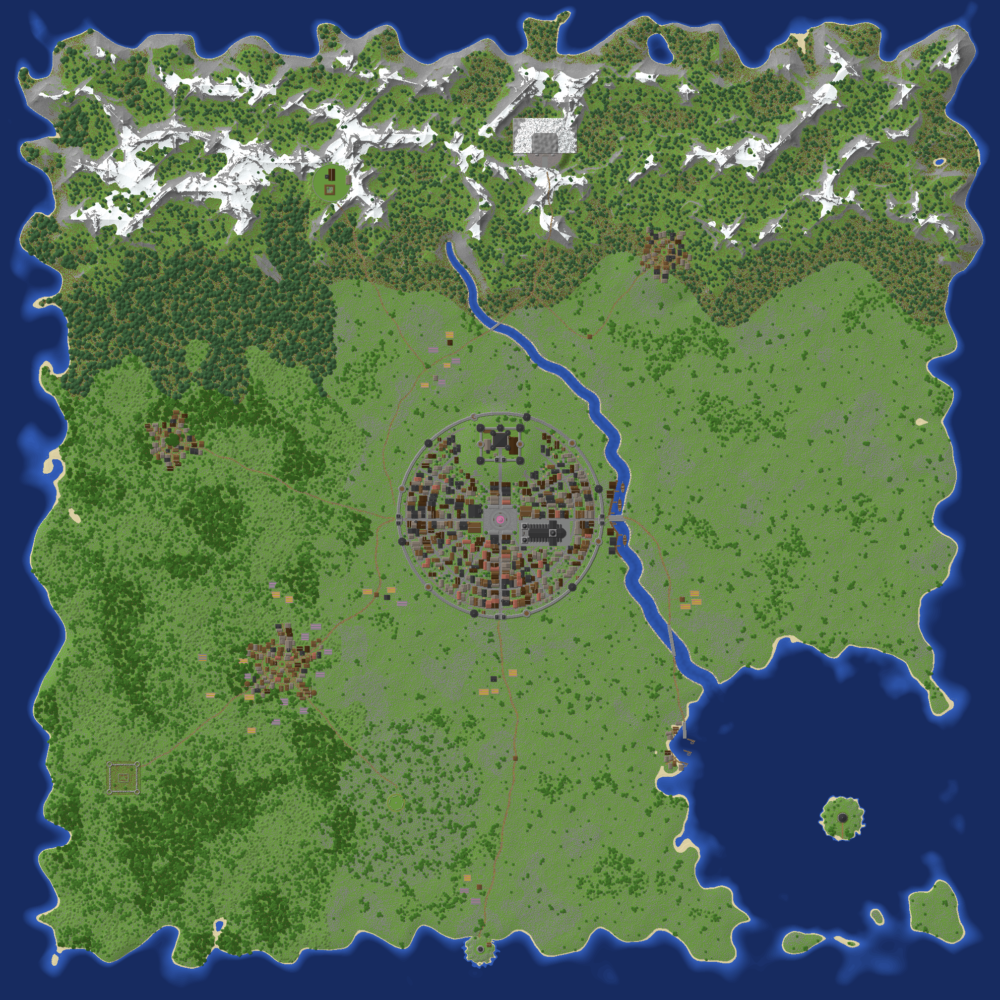
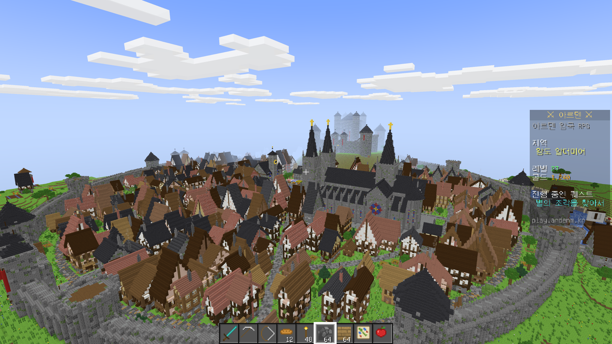
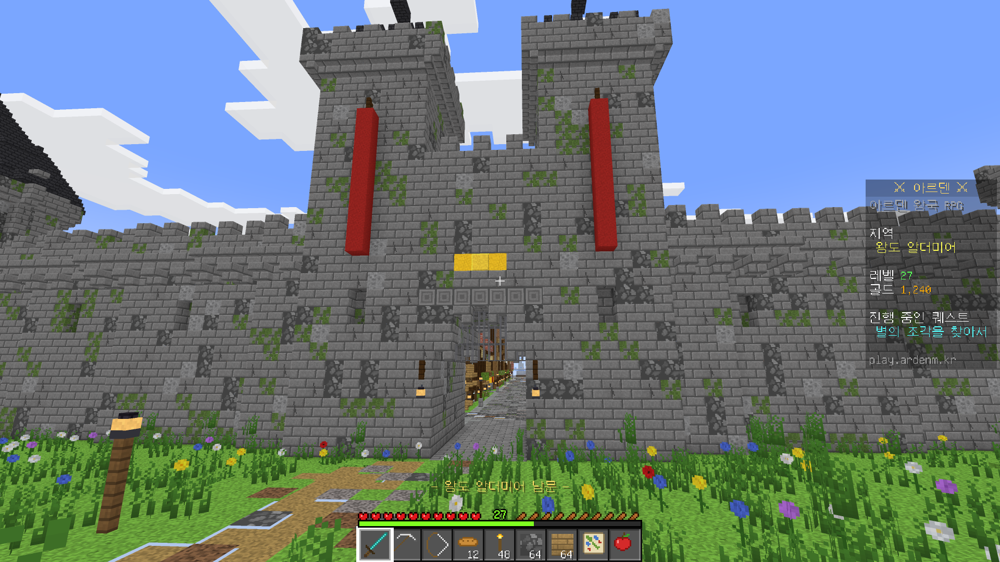
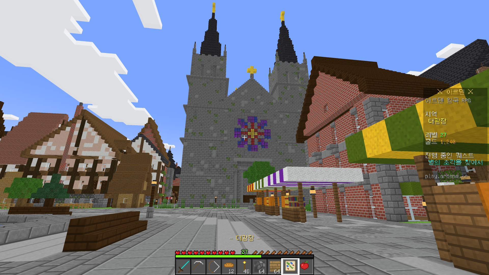
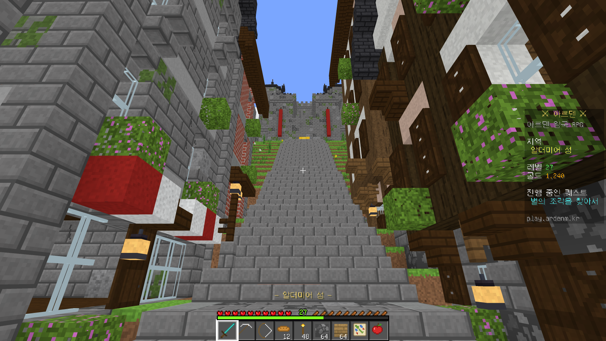
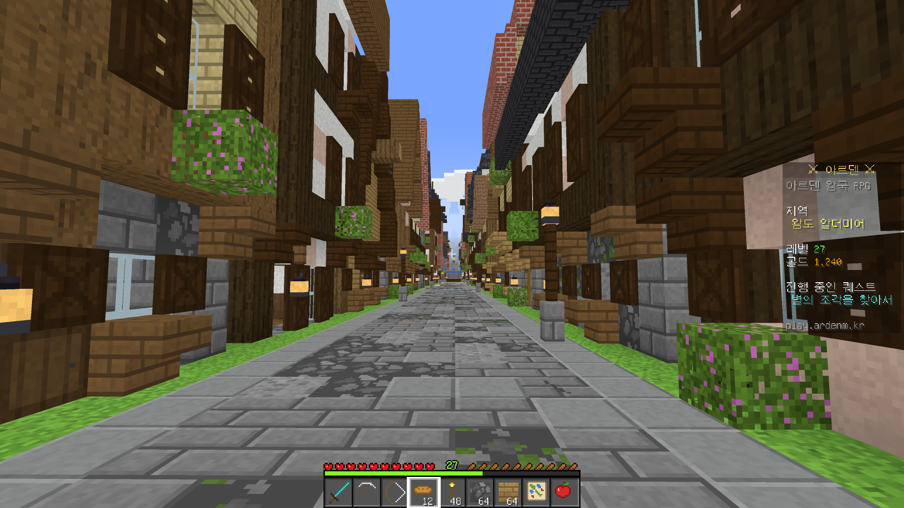
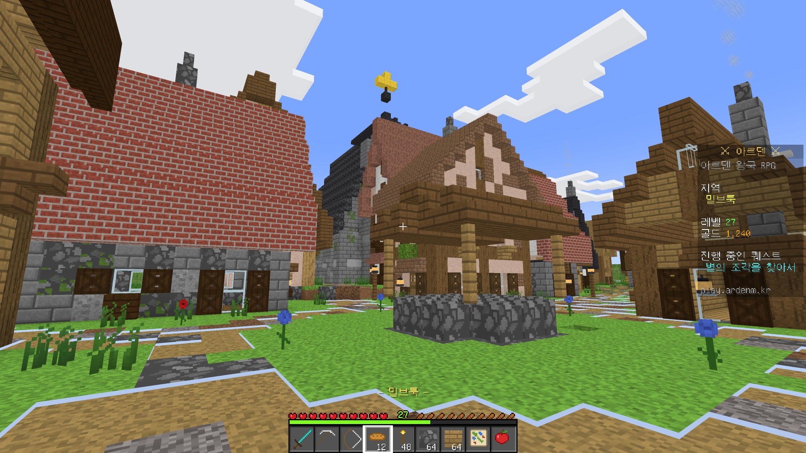
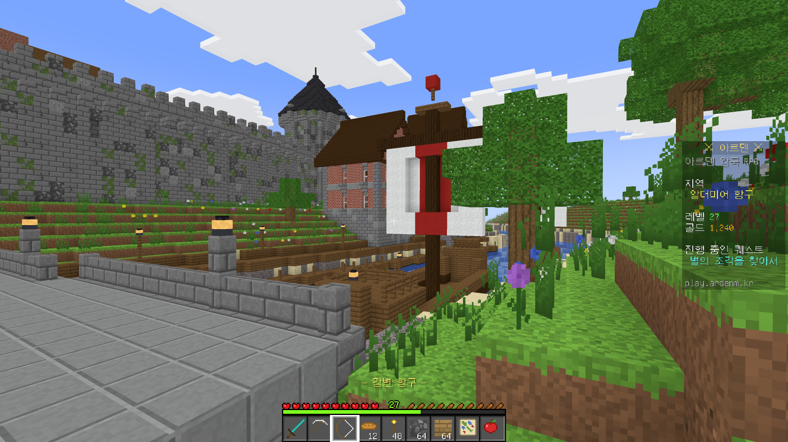
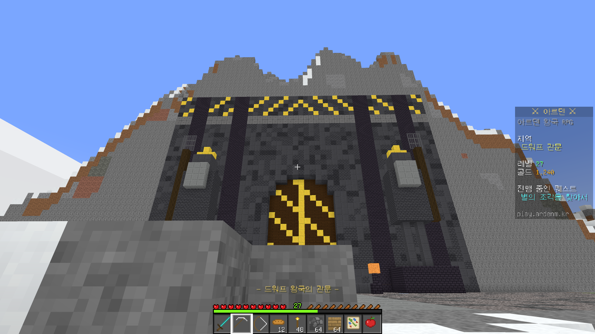

# 1세계 · 아르덴 왕국 (Minecraft Java 1.21 RPG 월드)

2016 × 2016 블록 크기의 서양 판타지 왕국입니다. 코드가 지형·건물·숲을 한 블록씩 직접 짓고,
그 결과를 서버에 바로 넣을 수 있는 월드 파일(`level.dat` + `region/*.mca`)로 내보냅니다.



## 들어 있는 것

| 구역 | 내용 |
|---|---|
| 왕도 알더미어 (중앙) | 지름 410블록 원형 성벽 · 둥근 망루 12개 · 성문 누각 3개 · 집 약 350채 · 거리 49개 · 가로등 · 뒤뜰·채소밭 |
| 알더미어 성 (북쪽 언덕) | 외벽+원탑 7개 · 성문 · 5층 본성(첨탑 4개) · 대연회장 · 예배당과 종탑 · 마구간 · 우물 · 훈련장 |
| 대광장 | 2단 분수 · 시장 노점 · 벤치 · 화단 나무 · 시청 시계탑 · 여관 · 길드 회관 |
| 성 알데릭 대성당 | 쌍탑 첨탑 · 장미창 · 비연 버트레스 · 스테인드글라스 · 익랑과 교차부 첨탑 · 앱스 · 신도석 |
| 강변 항구 | 널판 부두 · 잔교 · 창고 · 범선 3척 · 기중기 · 강을 건너는 돌다리 |
| 마을 4곳 | 밀브룩(풍차·밭·교회) · 갈매기 포구(잔교·조각배) · 하이패스(산악 마을·망루) · 엘더우드(거대 나무·나무 위 전망대) |
| 명소 | 별지기 마법사의 탑(호수 섬) · 무너진 그레이브 요새 · 구름 수도원(회랑) · 드워프 왕국의 관문(산을 깎은 문·석상) · 남쪽 등대 · 고대 거석 원 · 감시탑 3개 |
| 자연 | 북쪽 설산 · 강 · 남쪽 만 · 바이옴별 숲(참나무·자작·가문비·거대 가문비·짙은 참나무) · 나무 약 2만 4천 그루 · 풀과 꽃 |
| 길 | 성문에서 마을·명소로 이어지는 흙길과 돌다리 · 도로변 농가 |

집은 목조 골조(튜더), 밝은 목조, 석조, 벽돌, 시골, 산악, 어촌의 7가지 양식입니다. 한 채마다 크기·층수·지붕 재료·지붕 경사가 다르고,
돌출 2층, 도머 창, 원뿔탑, 발코니, 창 화단, 덧창, 굴뚝, 간판 들보, 실내 조명 등이 무작위로 붙습니다.

## 인게임 화면

셰이더 없이 기본 그래픽으로 렌더링한 1인칭 화면입니다(`screenshots/`).

| | |
|---|---|
|  |  |
|  |  |
|  |  |
|  |  |

## 서버에 넣는 법

1. 서버를 끕니다.
2. `dist/arden` 폴더를 서버 폴더에 `world` 라는 이름으로 복사합니다.
   기존 `world` 는 백업해 두세요. 다른 이름을 쓰려면 `server.properties` 의 `level-name` 을 그 이름으로 바꿉니다.
3. 서버를 켭니다. 처음 들어갈 때 빛 계산 때문에 잠깐 느릴 수 있습니다.

- 대상 버전: Java Edition 1.21.1 이상 (Paper·Spigot 포함). 더 새 버전 서버는 월드를 자동으로 변환합니다.
- 스폰: 남문 바깥 `0 75 263`, 기본 게임 모드 어드벤처(블록을 부술 수 없음).
- 월드 경계: 중심 `0, 0`, 한 변 2000블록. 경계 밖은 평평한 바다로 채워집니다.
- 게임 규칙: 불 번짐·몹 그리핑·습격·방랑 상인 끔 (목조 도시 보호).

## 좌표

| 장소 | 이동 명령 |
|---|---|
| 남문 스폰 | `/tp @s 0 75 263` |
| 대광장 분수 | `/tp @s 0 83 39` |
| 알더미어 성 | `/tp @s 0 119 -80` |
| 대성당 | `/tp @s 44 117 66` |
| 시청 | `/tp @s -52 98 22` |
| 여관 황금 그리핀 | `/tp @s 72 93 20` |
| 강변 항구 | `/tp @s 236 69 40` |
| 밀브룩 (풍차 농촌) | `/tp @s -440 84 330` |
| 갈매기 포구 (어촌) | `/tp @s 372 65 505` |
| 하이패스 (산악 마을) | `/tp @s 330 118 -500` |
| 엘더우드 (숲속 마을) | `/tp @s -660 107 -120` |
| 별지기 마법사의 탑 | `/tp @s 690 67 680` |
| 무너진 그레이브 요새 | `/tp @s -760 87 595` |
| 구름 수도원 | `/tp @s -340 156 -610` |
| 드워프 왕국의 관문 | `/tp @s 90 174 -688` |
| 남쪽 등대 | `/tp @s -40 75 893` |
| 고대 거석 원 | `/tp @s -210 85 610` |
| 서쪽 감시탑 | `/tp @s -250 73 195` |
| 북쪽 감시탑 | `/tp @s 180 81 -325` |
| 남쪽 감시탑 | `/tp @s 30 77 525` |

## 다시 만들기 · 고치기

Node.js 20 이상이 필요합니다. 다른 패키지는 필요 없습니다.

```sh
cd world1
node --max-old-space-size=12000 gen/main.js --out dist/arden   # 약 30초
```

| 파일 | 역할 |
|---|---|
| `gen/plan.js` | 도시·마을·명소 위치, 강, 도로 — 배치를 바꾸려면 여기 |
| `gen/terrain.js` | 높이맵 · 산맥 · 강 · 바다 · 바이옴 |
| `gen/build/house.js` | 집 생성기 (양식별 재료·지붕·창·장식) |
| `gen/build/castle.js`, `cathedral.js`, `civic.js`, `walls.js` | 성 · 대성당 · 광장/시청/여관/항구 · 성벽/망루/성문 |
| `gen/build/city.js`, `villages.js`, `landmarks.js`, `roads.js`, `nature.js` | 도시 거리와 집 배치 · 마을 · 명소 · 길 · 숲 |
| `gen/anvil.js` | 월드 파일(.mca, level.dat) 쓰기 |
| `tools/validate.js` | 내보낸 파일을 다른 NBT 파서로 다시 읽어 블록 단위로 비교 |
| `render/` | 스크린샷 렌더러 (`mesh.js` → `ingame.html`) |

## 알아둘 점

- 월드 파일은 독립 NBT 파서로 다시 읽어 48개 청크(블록 약 470만 개)를 원본과 비교해 모두 일치했습니다.
  실제 마인크래프트 서버에 올려 보는 확인은 아직 하지 않았습니다(이 작업 환경에서 서버 파일을 받을 수 없음).
  처음 켤 때 서버 로그에 오류가 있으면 알려 주세요.
- 상자·표지판·NPC 같은 블록 엔티티와 엔티티는 아직 없습니다. 퀘스트·NPC는 플러그인(Skript 등) 단계에서 넣습니다.
- 스크린샷의 사이드바·액션바·핫바는 서버 화면이 어떻게 보일지 보여 주는 예시이며, 실제 표시는 플러그인이 해야 합니다.
